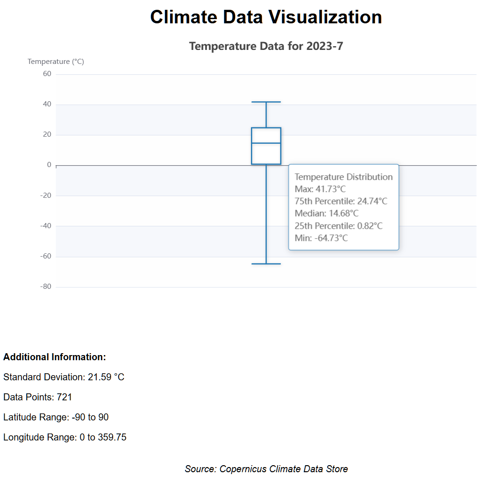

# Climate Data Visualization Project

This project is a FastAPI-based web application that fetches and visualizes climate data from the Copernicus Climate Data Store (CDS). It provides an API endpoint to retrieve temperature data for a specific year and month, and processes this data to provide useful statistics.



## Features

- Data Retrieval:
  - Fetch monthly average temperature data from the Copernicus Climate Data Store (CDS) API
  - Cache results for 24 hours
  - Support for specifying year and month for data retrieval

- Data Processing:
  - Process and analyze temperature data to provide comprehensive statistics
  - Calculate average, median, minimum, and maximum temperatures
  - Compute standard deviation for temperature variation
  - Determine 25th and 75th percentile temperatures
  - Provide latitude and longitude ranges for the data

- Data Visualization:
  - Interactive bar chart showing minimum, average, and maximum temperatures
  - Color-coded bars (blue for negative, red for positive temperatures)
  - Zero line for clear distinction between positive and negative values
  - Value labels on bars for easy reading
  - Labeled axes with temperature units (°C)

- API Endpoints:
  - RESTful API endpoint to retrieve processed climate data
  - Swagger UI documentation for easy API exploration and testing

- Error Handling and Logging:
  - Robust error handling for data retrieval and processing
  - Detailed logging for troubleshooting and monitoring

- Frontend:
  - Simple and clean HTML interface for data visualization
  - Integration of D3.js for creating dynamic and responsive charts

- Backend:
  - FastAPI framework for high-performance, easy-to-use API development
  - Efficient serving of static files for frontend assets

## Prerequisites

Before you begin, ensure you have met the following requirements:

- Python 3.7 or higher
- A Copernicus Climate Data Store (CDS) API key

## Installation

1. Clone the repository:
   ```
   git clone https://github.com/esoltys/climate-data-viz.git
   cd climate-data-viz
   ```

2. Create a virtual environment and activate it:
   ```
   python -m venv venv
   source venv/bin/activate  # On Windows, use `venv\Scripts\activate`
   ```

3. Install the required packages:
   ```
   pip install -r requirements.txt
   ```

4. Set up your CDS API key:
   - Create a file named `.cdsapirc` in your home directory
   - Add the following content to the file, replacing `YOUR-API-KEY` with your actual CDS API key:
     ```
     url: https://cds.climate.copernicus.eu/api/v2
     key: YOUR-API-KEY
     ```

## Usage

1. Start the FastAPI server:
   ```
   uvicorn app.main:app --reload
   ```

2. Access the API:
   - Open your web browser and navigate to `http://127.0.0.1:8000/docs` to view the Swagger UI documentation for the API.
   - Use the `/api/temperature` endpoint to retrieve temperature data for a specific year and month:
     ```
     GET http://127.0.0.1:8000/api/temperature?year=2023&month=7
     ```

3. View the Data Visualization:
   - Open your web browser and navigate to `http://127.0.0.1:8000/static/index.html`
   - You will see a bar chart displaying the minimum, average, and maximum temperatures for the specified month and year (currently set to July 2023).
   - The chart includes:
     - Red bars for positive temperatures
     - Blue bars for negative temperatures
     - A zero line to clearly distinguish between positive and negative values
     - Value labels on top of each bar for easy reading
     - Y-axis labeled with the temperature unit (°C)

4. Interpret the Visualization:
   - The x-axis shows three categories: Min (minimum temperature), Avg (average temperature), and Max (maximum temperature).
   - The y-axis represents the temperature in Celsius.
   - Each bar's height corresponds to the temperature value it represents.
   - The chart title indicates the year and month of the data being displayed.

5. API Response Format:
   When using the `/api/temperature` endpoint, you'll receive a JSON response with the following structure:
   ```json
   {
     "year": 2023,
     "month": 7,
     "average_temperature": 8.64,
     "median_temperature": 9.12,
     "min_temperature": -64.73,
     "max_temperature": 41.73,
     "std_deviation": 22.18,
     "unit": "Celsius",
     "data_points": 73728,
     "latitude_range": [-90.0, 90.0],
     "longitude_range": [0.0, 359.75],
     "25th_percentile": -8.31,
     "75th_percentile": 24.89
   }
   ```

Note: The current implementation uses fixed data for July 2023. To visualize data for different months or years, you'll need to modify the `main` function in `static/js/visualization.js`.

## Project Structure

```
climate-data-viz/
├── app/
│   ├── __init__.py
│   ├── main.py
│   ├── api/
│   │   ├── __init__.py
│   │   └── endpoints.py
│   ├── services/
│   │   ├── __init__.py
│   │   └── c3s_service.py
│   └── utils/
│       ├── __init__.py
│       └── data_processing.py
├── static/
│   └── index.html
├── .gitignore
├── README.md
└── requirements.txt
```

## Contributing

Contributions to this project are welcome. Please follow these steps:

1. Fork the repository
2. Create a new branch (`git checkout -b feature/your-feature-name`)
3. Make your changes
4. Commit your changes (`git commit -am 'Add some feature'`)
5. Push to the branch (`git push origin feature/your-feature-name`)
6. Create a new Pull Request

## License

This project is open source and available under the [MIT License](LICENSE).

## Acknowledgments

- [Copernicus Climate Data Store](https://cds.climate.copernicus.eu/) for providing the climate data
- [FastAPI](https://fastapi.tiangolo.com/) for the web framework
- [xarray](http://xarray.pydata.org/) for handling NetCDF data
