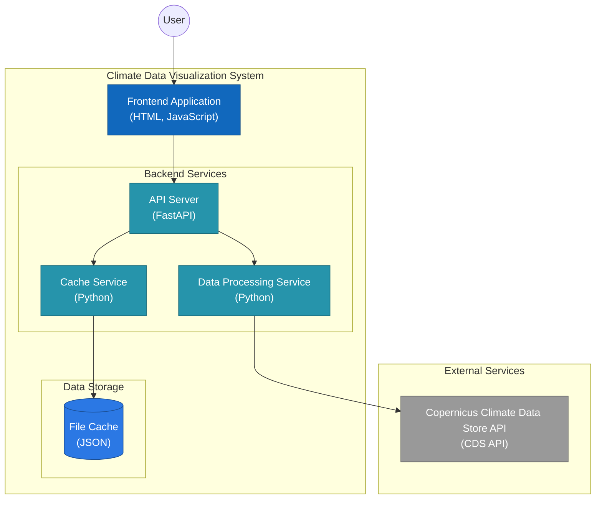

# Climate Data Visualization Project

This project is a FastAPI-based web application that fetches and visualizes climate data from the Copernicus Climate Data Store (CDS). It provides an API endpoint to retrieve temperature data for a specific year and month, and processes this data to provide useful statistics.


## Features

- Data Retrieval:
  - Fetch monthly average temperature data from the Copernicus Climate Data Store (CDS) API
  - Cache results for 24 hours
  - Support for specifying year and month for data retrieval

- Data Processing:
  - Process and analyze temperature data to provide comprehensive statistics
  - Calculate average, median, minimum, and maximum temperatures
  - Compute standard deviation for temperature variation
  - Determine 25th and 75th percentile temperatures
  - Provide latitude and longitude ranges for the data

- API Endpoints:
  - RESTful API endpoint to retrieve processed climate data
  - Swagger UI documentation for easy API exploration and testing

- Error Handling and Logging:
  - Robust error handling for data retrieval and processing
  - Detailed logging for troubleshooting and monitoring

- Frontend:
  - Simple and clean HTML interface for data visualization
  - Integration of Apache ECharts for creating dynamic and responsive charts

- Backend:
  - FastAPI framework for high-performance, easy-to-use API development
  - Efficient serving of static files for frontend assets

## Prerequisites

Before you begin, ensure you have met the following requirements:

- Python 3.7 or higher
- A Copernicus Climate Data Store (CDS) Beta API key https://cds-beta.climate.copernicus.eu/how-to-api

## Installation

1. Clone the repository:
   ```
   git clone https://github.com/esoltys/climate-data-viz.git
   cd climate-data-viz
   ```

2. Create a virtual environment and activate it:
   ```
   python -m venv venv
   source venv/bin/activate  # On Windows, use `venv\Scripts\activate`
   ```

3. Install the required packages:
   ```
   pip install -r requirements.txt
   ```

4. Set up your CDS API key:
   - Create a file named `.cdsapirc` in your home directory
   - Add the following content to the file, replacing `YOUR-API-KEY` with your actual CDS API key:
     ```
     url: https://cds-beta.climate.copernicus.eu/api
     key: YOUR-API-KEY
     ```

5. Accept the "Terms of Use" at the bottom of the Download tab for the dataset:
    - https://cds-beta.climate.copernicus.eu/datasets/reanalysis-era5-single-levels-monthly-means?tab=download
    - Currently configured for:
      - Product type: Monthly averaged reanalysis
      - Variable: 2m temperature
      - Year: 2023
      - Month: July
      - Time: 00:00
      - Geographical area: Whole available region
      - Data format: NetCDF4 (Experimental)

## Usage

1. Start the FastAPI server:
   ```
   uvicorn app.main:app --reload
   ```

2. View the Data Visualization:
   - Open your web browser and navigate to `http://127.0.0.1:8000/static/index.html`

3. Access the API:
   - Open your web browser and navigate to `http://127.0.0.1:8000/docs` to view the Swagger UI documentation for the API.
   - Use the `/api/temperature` endpoint to retrieve temperature data for a specific year and month:
     ```
     GET http://127.0.0.1:8000/api/temperature?year=2023&month=7
     ```

4. API Response Format:
   When using the `/api/temperature` endpoint, you'll receive a JSON response with the following structure:
   ```json
   {
     "year": 2023,
     "month": 7,
     "average_temperature": 8.64,
     "median_temperature": 9.12,
     "min_temperature": -64.73,
     "max_temperature": 41.73,
     "std_deviation": 22.18,
     "unit": "Celsius",
     "data_points": 73728,
     "latitude_range": [-90.0, 90.0],
     "longitude_range": [0.0, 359.75],
     "25th_percentile": -8.31,
     "75th_percentile": 24.89
   }
   ```

Note: The current implementation uses fixed data for July 2023. To visualize data for different months or years, you'll need to modify the `main` function in `static/js/visualization.js`.

## Running Tests and Type Checking

To run the tests, use the following command:

`pytest`

To check type annotations:

`pyright`

## Architecture



## License

This project is open source and available under the [MIT License](LICENSE).

## Acknowledgments

This project would not have been possible without the following open-source libraries and services:

- [Copernicus Climate Data Store](https://cds.climate.copernicus.eu/) for providing the climate data
- [FastAPI](https://fastapi.tiangolo.com/) for the web framework
- [Uvicorn](https://www.uvicorn.org/) for the ASGI server
- [cdsapi](https://pypi.org/project/cdsapi/) for accessing the Copernicus Climate Data Store
- [xarray](http://xarray.pydata.org/) for handling multi-dimensional arrays and NetCDF data
- [NumPy](https://numpy.org/) for numerical computing
- [python-dotenv](https://pypi.org/project/python-dotenv/) for managing environment variables
- [Pydantic](https://pydantic-docs.helpmanual.io/) for data validation
- [Requests](https://docs.python-requests.org/) for making HTTP requests
- [pytest](https://docs.pytest.org/) for testing
- [Apache ECharts](https://echarts.apache.org/) for creating dynamic, interactive data visualizations in web browsers

These tools and libraries have greatly contributed to the development and success of this project.

